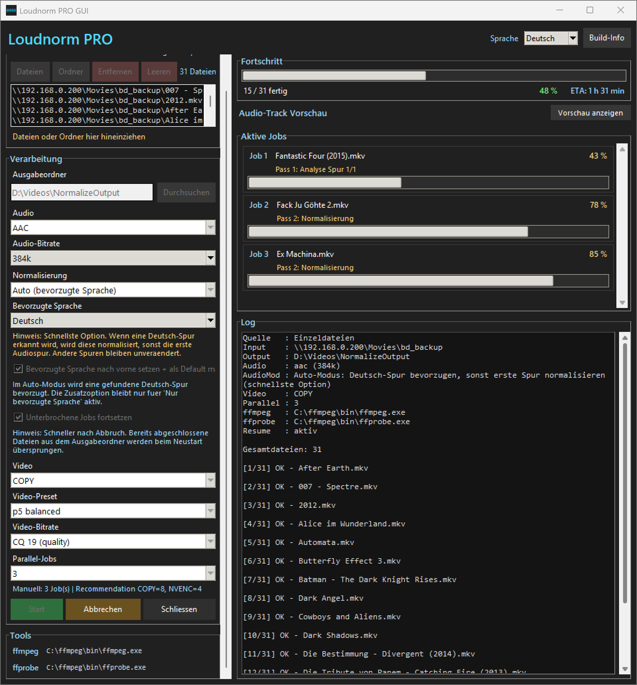

# Loudnorm PRO

A fast and simple GUI for batch audio normalization using FFmpeg (loudnorm).

## ✨ Features

* Batch processing of video files
* Automatic audio track detection (by language)
* Loudness normalization (EBU R128 / ffmpeg loudnorm)
* Hardware encoding support (NVENC)
* Parallel processing
* Audio bitrate presets
* Video presets & CQ settings
* German / English UI
* Resume interrupted jobs

## 🖥️ Screenshot



## ⚙️ Requirements

* Python 3.10+
* FFmpeg & FFprobe in PATH

* (Windows users can download the EXE from Releases; Python is only needed to run from source.)

## 📦 Installation

```bash
git clone https://github.com/urscaviezel/loudnorm-pro.git
cd loudnorm-pro
pip install -r requirements.txt
python loudnorm_gui.py
```

## 🏗️ Build EXE

```bash
python -m PyInstaller --onefile --windowed --icon=loudnorm_pro_icon.ico loudnorm_gui.py
```

## 📄 License

This project is licensed under the GNU GPL v3.

## ⚠️ Note

FFmpeg is not included. Make sure it is installed separately.

Download latest version:
https://github.com/urscaviezel/Loudnorm-PRO/releases

---

Made with ❤️ for fast media workflows.
